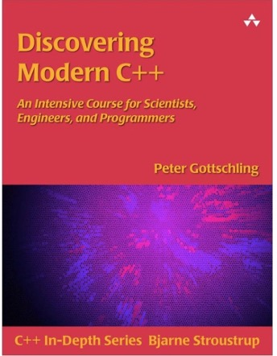

# Welcome to Software Foundations -- ECE141a
## Assignment #1 -- Due Wednesday, January 15, 11:15pm

This assignment will help you develop skills with streams. Streams are the first objects most C++ programmers interact with. We talked about streams during lecture, so feel free to review the slides. 

## Part 0 - Assigned Reading

Read chapter 1.7 (streams) and 2.1-2.6 about classes in your textbook: "Discovering Modern C++". 

Estimated newbie time: 1-2 hours.



## Assignment Overview

If you open main.cpp, you'll see it refers to the following classes: 

- TextStreamWriter.cpp
- TextStreamTokenizer.cpp
- TextStreamLineReader.cpp
- JSONStreamWriter.cpp
- BinaryStreamWriter.cpp

The `main()` function itself instantiates an object of each type, and calls the object.run() method. You're going to implement the run() method for each of these classes. The details of each challenge are outlined below. Truthfully, the tasks in this assignment are pretty easy. What might make them seem harder, is your lack of experience with streams, and perhaps with working with C++ classes. No better way to learn than to jump right in!

NOTE: If you examine the top of your main.cpp file, you'll see a constant called `kProjectFolderPath`. It is ESSENTIAL that you provide a character string value for this constant, that represents the path to the project folder on your computer. Fail to do so, and your code won't work, because the objects won't know where to read/write files.

## Part 1 -- Simple I/O with streams

For this part, you're going to read and write data to the terminal, using `std::cin` and `std::cout`. As you've read in the book, `std::cin` is used for gather user input from the terminal, and `std::cout` is used for write data to the terminal. 

You will implement this 
First, show a prompt to the user asking them to enter their name, then collect the name they enter into a string variable. Next, ask the user to enter their age, and collect their input into an integer variable.

> Enter your name: ..user types "Bob"... 
> Hi Bob, enter your age: ..user types 20...
> Thanks Bob, you did a good job for someone who is 20! 

Estimated newbie time: 15 minutes


## Part 2- Writing text data to a file-stream

For this part, you'll implement the run() method for the class found in the `TextStreamWriter.cpp` file. 

The `TextStreamWriter.run()` method will help you generate a multi-line text file (using streams) that contains two randomly generated integers per line. The class constructor requires a path to your root folder, and the filename ('numbers.txt'). Your output file will look something like this:

```
23 85
6  709
83 14751
```

It is your responsibility to add a data member called `output` to the `TextStreamWriter` class of type `ofstream`, which can write streams to the file system (see your book for more details). Also, you have to "open" the output stream for writing in the class constructor.

Estimated newbie time: 1 hour.

## Part 3 - Simple token-oriented input from a stream 

For this task, you'll implement the `TextStreamTokenizer.run()` method, which will read the contents of the textfile you generated in part #2 (above).

The `TextStreamTokenizer.run()` method will read the given text file. It will read two integers from each line. After doing so, it will compute the sum of the two integers, and write the result to a given output stream. For every 2 integers you read from a given line, you will output 1 line with the result to a (given) output stream. 

As before, you need to declare an std::ifstream class in your `TextStreamTokenizer`, and open the stream for reading in your constructor.

Estimated newbie time: 1 hour.

## Part 4 - Reading entire lines of text from a stream

For this task, you'll input from the file you created in Part #2, only this time you'll read the input one line at a time. After reading each line, you'll parse and tokenize the integers from the line. Then you'll write the output to a stream (provided to you) as you did in part #3.

```
TextStreamLineReader::run(std::ostream &anOutput) {
  
  int theFirst, theSecond; //for reading integers...
  
  std::string theLine;
  while (std::getline(input, theLine)) {
    //add code to parse the two integers from within *theLine*...
     output << theFirst << "+" << theSecond << "=" << theFirst+theSecond << std::endl;
  }    
}
```

Estimated newbie time: 1 hour.

## Part 5 - Writing JSON to a file stream

For this task, you'll create a text file that contains json data. JSON is a text-encoding of key value pairs, commonly used by programmers to move data around on the internet. You can learn more by visiting this site: 
https://developer.mozilla.org/en-US/docs/Learn/JavaScript/Objects/JSON 

In the `JSONStreamWriter.cpp` file you'll find two classes:

1. Student class
2. JSONStreamWriter class

The `Student` class is a trivally simple class that contains data that describes YOU. Your first challenge is to create a `Student` object, and set all the associated properties so that the object represents YOU (name, student#, and so on). The `JSONStreamWriter` class writes the data properties found in the `Student` class to a text file (called aboutme.json) in your project folder.

The output of your `aboutme.json` file should look something like this:

```
{
  "name"  : "Your Name",
  "pid"   : "Your StudentId",
  "email" : "Your Email",
  "os"    : "windows|mac|linux",
  "course": "ECE141A"
}
```

The boilerplate to complete this task is already set up for you, with comments to indicate what you still need to complete. Generally speaking, you need to: 

#1 Initialize a `Student` class with your personal information,  
#2 Implement operator << method on the Student class to emit your student object in json format

Estimated newbie time: 1 hour.

## Part 6 - Writing binary data to a file-stream

For our final challenge, you will create a __binary__ file (using streams) that contains N blocks of an equal (fixed) size. Each fixed-sized block will contain characters of a given value. No two blocks will contain the same character. You might mentally visualize the block sequence like this:

```
AAAAAA
BBBBBB
CCCCCC
DDDDDD
(etc)
```

Opening a stream in "binary" mode is done using settings, which have already been set up for you on the `BinaryStreamWriter` class. Your job will be to write blocks of data, filled with a given character, into the binary stream. Once again, your project contains a good start on the code necessary to do this work. Just look for comments in the code that indicate where you need to add code.

What most of you will discover to be your biggest challenge, is how to create and "write" a buffer full of data (block) into the stream. It's up to you to learn how to do this from your textbook, or online resources.  You can ask your peers, use the google machine (or stackoverflow!) -- but you MAY NOT copy code from any source.

Estimated newbie time: 2 hours.


## You're DONE! 

Once you write, compile, test, and debug your code, you're ready to check it all back into github.  

NOTE: Please don't forget to manually fill out your student.json file. Vlad-the-compiler uses this information to record your grade. If the file is missing (or incomplete) -- you'll get zero points for the assignment. Please don't make this newbie mistake!
