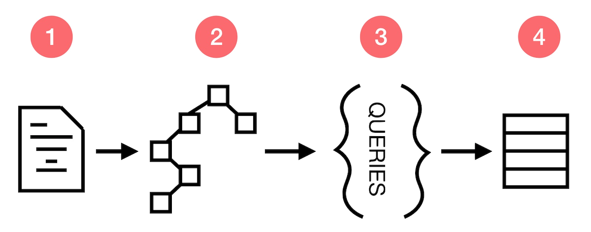
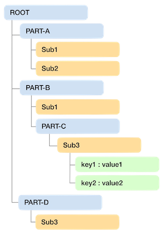

# WI20-Assignment4
## Running Queries against complex models using the STL
### Due Saturday Feb 29 at 11:15pm

# Introduction

In this assignment, you will continue to develop your software design skills AND gain experience working with STL containers, iterators, and algorithms.  You're going to be building a small data container, and a simple query language to retrieve results.  This assignment will lead you to get some experience with the following idioms:

1. Some practice with STL containers and iterators
2. Practice building a complex model
3. Practice using interfaces and the `adapter` design pattern
4. Practice using the `Command` design pattern
5. Practice building a "mini-language" to work with a virtual model

> NOTE: We've given you some starter code. But that doesn't mean it's all complete, or won't need to be adapted to meet your needs. YOU are responsible to make changes to the given code if your solution requires it. You can't change or remove the definition of given methods, but you can add your own, and change how things are implemented.  (You might not need to make any changes). 

This assignment has four parts:



## Part 1 -- Reading a JSON file

In part one -- you'll read the contents of a (complex) text file in the JSON format.  Fortunately - we're providing you with tools that give you a big headstart on this step.

## Part 2 -- Building a `Model` (graph) of "elements" that reflects the JSON file

The JSON file you are reading describes a complicated graph of data elements (collections of key/value pairs, and simple element lists). You will use STL containers to build an in-memory representation (a model) of the hierarchy represented in the JSON file. You will build and manage that graph in a class called `Model`.  

## Part 3 -- Processing queries

Once your model is built, it's time to ask it questions. Your model offers a set of methods that makes it possible to build simple queries:

```
  //These indicate where to look in your model...
    ModelQuery& within(const std::string &aTarget);
    ModelQuery& before(const std::string &aTarget);
    ModelQuery& after(const std::string &aTarget);

   //These specify what you want to retrieve...
    ModelQuery& all(const std::string &aTarget);
    ModelQuery& first(const std::string &aTarget);
    ModelQuery& last(const std::string &aTarget);
    ModelQuery& nth(const std::string &aTarget, size_t anIndex);

   //these statements get results (and are always the last part of a query)
    size_t count(); //how MANY items are in the result set?
    double sum(const std::string &aField);  //what's the sum of a given key/value in the result set
    double avg(const std::string &aField);  //what's the sum of a given key/value in the result set
    ModelCollection* get();  //get a result (one or more elements, or a value if you're targeting a key)
    std::string get('keyvalue');  //get the value as a string for the named key
```

### -- A Note about these statement types

In the list of methods (above), there are 3 types of statements:

1. Those that specify where to look (`within`, `before`, `after`) (you may specify more than 1)
2. Those that specify what you want (`all`, `first`, `last`, `nth`)
3. Those that produce a result (`get`, `count`, `avg`, `sum`) -- these are always specified last!

A large variety of queries can be built by chaining various statements together. Most statements can be given in any order, but the `count`, `sum`, and `get` statements must be the last in the query.

#### -- Example

To build (and run) a query, you start by asking your `Model` class for a new query:

```
auto theQuery = theModel.query();
```

Then you add specific statements to the query, to express what you're looking for. 

```
theQuery.within("sammy").after("list");
```

Then you tell the query the _type_ of result you're looking for. This may be a collection of nodes in your model (`get()`), or the `count()` or `sum()` of values in the result set. 

Putting it all together, it looks like this:

```
size_t theCount=theQuery.within("xxx").first("chandini").after("renjei").count();
```

This query indicates it wants to know how how many nodes with the name "Chanhini", follow a node named ("renjei"). 


## Part 4 -- Returning results (one or multiple items)

Once you've proceeded the query, you will return a result. The result may be a single item (like a count or a value), or it might be a collection of `ModelNode` elements from your `Model`.  When you need to return a collection of `ModelNodes` from your `Model`, you'll return a `ModelCollection`.  This is a object (probably uses STL container internally) to hold a set of results from the query. 

# Understanding JSON

JSON or JavaScript Object Notation is a lightweight text-based open standard designed for human-readable data interchange. It is easy to read and write and also language independent.

* It is primarily used to transmit data between a server and web applications. Web services and APIs use JSON format to provide public data.
* It is also used for serializing and transmitting structured data over network connection.

This is what a json looks like - 

```javascript
{
    "courseId":"ECE-141A",
    "courseName":"Software Foundations - I",
    "studentList":[
        {
            "id":"foo",
            "name":"Foo Bar",
            "pId":"A22222222",
            "gpa":3.95,
            "isGradStudent":true
        },
        {
            "id":"bar",
            "name":"Bar Foo",
            "pId":"A99999999",
            "gpa":3.85,
            "isGradStudent":false
        }
    ],
    "schedule": {
      "lectures": "Tu-Thu 9:30AM",
      "discussions": "Mon 4:00PM"
    }
}
```
### Syntax
   
1. Json data can either be an Object or a List of Objects. Curly braces (`{}`) hold objects and Square brackets(`[]`) hold lists. 
2. In an object, data is represented as collection of key-value pairs. Each key is followed by colon(`:`) and then its valye. key-value pairs are separated by commas(`,`). For example - `"courseId":"ECE-141A"` is a key-value pair in the above example. It is followed by a comma(`,`) and then the next pair is mentioned.
3. key is always a string in double quotes (`""`). For example - `courseId`, `courseName`, `studentList`, `gpa` etc. are all keys in the above example.
4. Json supports multiple data types for values. Value can be one of the followings - 
   
   * **number** - floating point numbers or Integers. For instance - value for the field `gpa`
   * **string** -  a Unicode string in double quotes(`""`). For instance - value for fields `courseId`, `courseName` etc.
   * **boolean** -  boolean flag (`true/false`). For instance - value for the `isGradStudent` field in the student object.
   * **json object** - Value can also be another json object. For instance - value for the `schedule` key. This gives json a tree like structure and makes the storage of hierarchial data easy.
   * **array** - The value can also be an array. Square brackets(`[]`) are used to hold arrays. Values within an array are separated by commas. The value can be any valid value type(number, string, boolean, json object or even an array). For instance - the value for the key `studentList` is an array of json objects.
   * **null** -  The value for a particular key can also be `null`. This is equivalent to key being not present.  

> The flexibility in the value types allows us to store complex data structures. For example - You can have an object which contains a list of objects where each object has a list of lists.

> Notice that there are no double quotes `""` for primitive values like `number`, `boolean` and `null`. `true` and `"true"` are different values. 

### Resources
There are a lot of good resources on the web if you want to read further. Sharing a few here - 
* https://www.tutorialspoint.com/json/index.htm
* https://json-schema.org/understanding-json-schema/

# Constructing a model from a JSON file

## Using the provided `JSONParser` class

Good news -- we've already built a `JSONParser` class that can read the data in the given JSON file.  As the `JSONParser` reads your file, it will notify an object that implements the `JSONListener` interface. Your `JSONListener` will follow the intructions provided by the `JSONParser`, and build a corresponding graph of objects in memory (using STL containers and custom classes you build) to fully represent the graph described in the JSON file.

The `JSONListener` interface is shown below:

```
  virtual bool addKeyValuePair(const std::string &aKey, const std::string &aValue)=0;
  virtual bool addItem(const std::string &aValue)=0;
  virtual bool openContainer(const std::string &aKey, Element aType)=0;
  virtual bool closeContainer(const std::string &aKey, Element aType)=0;
```

## Building Your In-Memory Object Graph (model) 

The `JSONParser` can tell you what it finds in a given JSON file, but it doesn't know how to build an object graph. You have to write code to do that yourself. Here's what you'll do:

1. Your `Model` class is a subclsss of the `JSONListener` interface (so you'll implement those methods)
2. As you get instructions from the `JSONParser`, your `JSONListener` will build an in-memory collection of items according to the instructions you receive. Build this hierarchy any way you like -- and use any of the STL classes. 


# Processing Queries 

Once you have constructed an in-memory representation of the JSON file, it's time to answer queries about it. To do so, you'll need to construct a command-processor and accept and answer simple questions.  We already created the first part of this:

1. Define `CommandProcessor` interface (already done for you in `JSONParser`. 
2. Connect the `CommandProcessor` to a filestream (to read commands from a file).  Each line of the command file contains one query 
3. As the processor reads each line of the "commands" file, its `run()` method is called.
3. The `CommandPocessor` will interact with your `Model` object to answer the associated question and provide a response.  You'll print your answer to the given output stream. 

> NOTE: The commands given on each line of your "commands" file may need to be reordered when you convert them to statements suitable for a query.

## Your query "language"

### These indicate your target location, or location relative to another thing

#### within(name)
The `within(name)` statement indicates that results for your named element must occur within a named element (container). The `within()` statement is often used in combination with other statements. 

#### before(name)
The `before(name)` statement specifies that results for your named element must occur before a named element. 

#### after(name)
The `after(name)` statement specifies that results for your named element my occur after a named element. 

### These indicate the target you're looking for...

#### all(name)
The `all` statement is used when the user wants to return every element that matches the given name.

#### first(name)
The `first()` statement limits the number of results to the _first_ element that matches the given query inside a container. Imagine you have a complex `Model` that contains N elements with the label of "foo".  Using the `.first()` statement, the result set would only include the first "foo" element found during iteration.

#### last(name)
The `last()` statement limits the number of results to the _last_ single element that matches the given query. Imagine you have a complex `Model` that contains N elements with the label of "foo".  Using the `.last()` statement, the result set would only include the last "foo" element found during iteration. 

#### nth(name, pos)
The `nth()` statement limits the number of results to the _nth_ single element that matches the given query. Imagine you have a complex `Model` that contains N elements with the label of "foo".  Using the `.nth(2)` statement, the result set would only include the _nth_ "foo" element found during iteration.  

> We represent the position of elements using a _cardinal_ numbering scheme -- where the first element pos = 1. 

### These statements gather the results and return them to the user...

#### count(name)
The `count()` function specifies that the result should be an integer quantity that represents the number of elements in the result set.

#### sum(name)
The `sum()` function specifies that the result should be an integer quantity that represents the computed "sum" of element (values) in the result set that match the given fieldname.

#### avg(name)
The `avg()` function specifies that the result should be an integer quantity that represents the computed "average" of element (values) in the result set that match the given fieldname.

#### get()
The `get()` function is by far the most common statement. When used, it returns the collection of elements from your `Model` that the given query specification. The result may contain one or more elements.  

#### get('key')
The `get(key)` function attempts to retrieve the value for a key, as specified by the given query.  


### Query Examples 

Assuming you have a JSON file like this:

```javascript
{
  "root" : {
    "part-a" : [
      "sub1", "sub2"
    ],
    "part-b" : [
      "sub1", 
      {
        "part-c" : {
          "key1" : "value1",
          "key2" : "value2"
        }
      }
    ],
    "part-d" : [
      "sub4"
    ]
  }
}
```

And it turns into an in-memory model like this: 



The queries are applied to a specific level you are at(Starting from root). For nested queries, we can chain the keys using dot `.`. We can also use star `*` operator in target queries(first, before, last etc.) to return node irrespective of the name. We can assume that the queries would be executed in left-to-right order. We'll test your code only on queries which are valid or makes sense. 

> NOTE: Query logic always follow these rules: 
> 1. If no location is given, presume the query implies the top (root) of your model
> 2. If the query asks for "un-named" elements (like all()) -- only search in the given container (don't search within child-nodes)
> 3. If the query asks for a specific key (e.g. "chandhini") -- you must search in all child nodes inside the named locationl
> 4. The asterisk (`*`) means "any" or "everything"

#### Here are a few sample queries:

1. `first("root")` will return a collection with a single `Node` - it's key as `root`.
2.  `within('root.sub3').get('key1')` -- get a single value for the specified key
3. `within("root.part-b").first("*")`. will return a node which just contains `sub1`. Notice how we used the `.` operator to chain keys for sub-tree lookups.
4. `after("root").all("*")` will return an empty result since there's no node after root in the model. Notice that all the data is within root.
5. `.within("root").all("*")` will return a list of nodes corresponding to `part-a`, `part-b`, `part-c`. Notice how the result is different from the first query. Since you didn't name a specific key, we only search in the given container (`root`). 
6. `.within("root").after("part-a").first("*")` will return a node corresponding to `part-b`.
7. `.within("root").before("part-d").first("*")` will return a node corresponding to `part-b`. Notice that the behavior of `first` query would differ if the prior query was `after`(return the next node) or `before` (return the node jus before).
8. `.within("root").first("part-a").all("*").count()'` will return count as `2`. It first goes inside the root. then it looks for first `part-a` before `part-d`. This returns a result with a single node with key as `part-a`. Then you do `.all("*")"` to get the child elements of the node. Now the result contains two nodes (`["sub1", "sub2"]`). Finally the count of this result is returned which is `2`.    

Similarly, you can think of other such valid queries. Please ask your questions on SlideSpace if there's any confusion about what a particular query should return so that others can also benefit from it.  It's kind of fun to see how creative you can be -- or -- try to break the system!

# Returning a Query Response from your Model 

Your query response will take one of three forms, depending on the query:

1. A count (`integer`) 
2. A compute result (`avg`, `sum`) after analyzing a result set
3. A `ModelCollection` of elements as a set of results from the `get()` request

> If your query requires that you return multiple `ModelNodes`, then you do that by returning a `ModelCollection`. This object should be able to hold as many `ModelNodes` from your `Model` as are necessary. Note, however, that a `ModelCollection` doesn't own the `ModelNodes` and should not delete them.  They will ultimately be deleted when your `Model` gets destructed. 

# JSONParser Code Analysis (EXTRA CREDIT)

Write a brief analysis of the code provided in the `JSONParser` class. Review for clarity of design, simplicity, correctness, coding style.  Write your answer in a textfile called "code-review.txt".  

# Testing

We've provided a testing framework for you, much like before. To run a test, you need to give the `Testing` class two files (examples provided). First -- you need a .json file that contains the data you to load into your `Model`. Then you need a "commands" file. The commands file has a series of line, each of which is a text-representation of a query. Your testing class reads each line, and calls the `CommandProcessor` class. The `CommandProcessor` class is responsible for converting the text version of the command into a series of "query statements" that your `Model` provides. 

While we've given you a simple test file (test.json) and associated commands file (test.txt).  After you get these to work, try making your own files:

1. Using the `JSON` example above, make a commands file to try out different queries.
2. Try making your own JSON file (or get one from the web) -- then try making sample queries to test. 

# Grading

- 60% - Code that builds a correct in-memory model
- 10% - Code that converts command file (lines) to correct query statements
- 10% - Code that correctly executes every statement type
- 10% - Code that returns the correct results 
- 10% - Code with no functions greater than 50 lines of code
- 10% - EXTRA CREDIT: Reasonable answer to `JSONParser` Code Review question (above)


# Submitting your work
### Due Saturday Feb 29 at 11:15pm

As usual, submit your code to github, and also to gradescope.  Don't forget to fill out the student.json file too. 
Good luck!
